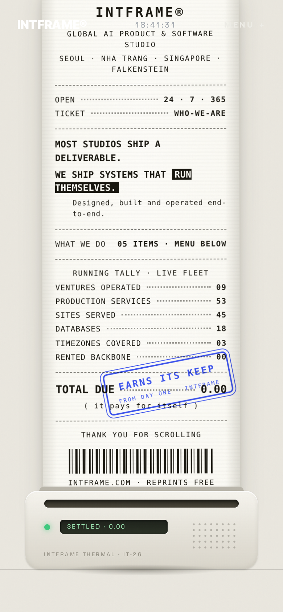

# thermal-receipt

A scroll-driven thermal receipt printer UI component for React.

[](https://www.npmjs.com/package/@intframe/thermal-receipt)
[](https://github.com/intframe/thermal-receipt/actions/workflows/ci.yml)
[](LICENSE)



Scroll down the page and a little thermal printer prints your content, line by line, onto a receipt. Each line comes out pale and "develops" into ink, the paper advances in 3px stepper-motor increments, the LCD reports which line is printing, a rubber stamp slams onto the total, and at the end the receipt tears off and drops away.

No animation libraries. No dependencies beyond React. Scroll progress is computed from `getBoundingClientRect` inside a single `requestAnimationFrame` loop, and every visual beat is plain CSS.

## Features

- **Thermal develop**: freshly printed lines start pale and darken to ink, like real thermal paper
- **Stepped paper feed**: the printed length is quantized to 3px steps for a mechanical transport feel
- **Live LCD**: `IDLE · READY` → `PRINTING · LN 07/24` → `SETTLED` → `TEAR OFF` → `THANK YOU`, all text overridable
- **Stamp slam**: a rubber stamp scales down onto the total with a back-out ease at 80% progress
- **Tear-off finale**: the receipt drops away, a serrated paper stub remains in the slot, and an optional outro fades in
- **Two drive modes**: self-driven (it owns a scroll section) or controlled (you pass `progress` from 0 to 1)
- **Cursor tilt** (optional): the paper leans slightly toward the pointer on fine-pointer devices
- **Respects `prefers-reduced-motion`**: renders the fully printed receipt without animation
- **Zero dependencies**: React 18/19 peer dependency only, styles ship as a plain CSS file

## Quickstart

Run the demo locally:

```bash
npm install
npm run dev
```

Or use it in your app:

```bash
npm install @intframe/thermal-receipt
```

```tsx
import ThermalReceipt, { type ReceiptLine } from "@intframe/thermal-receipt";
import "@intframe/thermal-receipt/style.css";

const lines: ReceiptLine[] = [
  { kind: "logo", text: "CAFE MERIDIAN" },
  { kind: "center", text: "SPECIALTY COFFEE · SINCE 2019" },
  { kind: "rule" },
  { kind: "kv", label: "FLAT WHITE", value: "4.50" },
  { kind: "kv", label: "ALMOND CROISSANT", value: "3.75" },
  { kind: "rule" },
  { kind: "total", label: "TOTAL", value: "8.25", note: "( card · contactless )" },
  { kind: "barcode" },
  { kind: "center", text: "THANK YOU FOR SCROLLING" },
];

// Self-driven: renders a 390vh scroll section and drives itself.
<ThermalReceipt lines={lines} stamp={{ title: "PAID IN FULL" }} />

// Controlled: you own the progress value (scroll library, slider, timeline...).
<ThermalReceipt lines={lines} progress={p} />
```

In controlled mode the component fills its parent element, so give the parent a height and `position: relative`.

## Props

| Prop | Type | Default | Description |
| --- | --- | --- | --- |
| `lines` | `ReceiptLine[]` | required | Receipt content, printed top to bottom. See line kinds below. |
| `stamp` | `{ title, subtitle? }` | – | Rubber stamp anchored to the `total` line. Slams down during the stamp phase. |
| `progress` | `number` (0..1) | – | Controlled mode. Omit entirely for self-driven scroll mode. |
| `scrollLength` | `string` | `"390vh"` | Self-driven mode only: height of the scroll section. |
| `cursorTilt` | `boolean` | `true` | Paper tilts toward the cursor (fine pointers only). |
| `printerLabel` | `string` | `"THERMAL · TR-26"` | Small label printed on the printer body. |
| `lcd` | `{ idle?, stamp?, tear?, out? }` | – | Override the LCD status text per phase. |
| `outro` | `ReactNode` | – | Content revealed in the stage after the receipt tears away. |
| `className` | `string` | – | Extra class on the root section. |

### Line kinds

| Kind | Fields | Renders as |
| --- | --- | --- |
| `logo` | `text` | Large centered wordmark |
| `center` | `text` | Small centered caption |
| `rule` | – | Dashed divider |
| `kv` | `label`, `value` | Label ... value row with a dotted leader |
| `big` | `text`, `em?` | Bold statement; `em` renders as an inverted ink box |
| `sub` | `text` | Small indented footnote |
| `total` | `label`, `value`, `note?` | Total row; the stamp anchors here |
| `barcode` | – | Decorative barcode block |

## How it works

- **Scroll progress**: in self-driven mode a `requestAnimationFrame` loop reads the section's `getBoundingClientRect()` and maps `-top / (height - viewportHeight)` to 0..1, then smooths it with an exponential lerp. An `IntersectionObserver` pauses all work while the component is off-screen.
- **Thermal develop**: every line starts at a pale paper-ink color. Once a line's bottom edge clears the printed length, it gets a `data-on` attribute and a CSS `color` transition develops it to full ink. Scrolling back up un-develops it.
- **Paper feed**: the paper element's `height` is the print progress times the content height, quantized with `Math.floor(len / 3) * 3`. The 3px steps are what make it feel like a stepper motor instead of a smooth reveal.
- **Phases**: progress thresholds map to `idle → print → stamp → tear → out`, written to a `data-phase` attribute on the root section. Every phase effect (printer shake, LED blink rate, stamp slam, tear-off transform, stub reveal, outro fade) is pure CSS keyed off that attribute, so the JS loop only flips one attribute per phase change.
- **Stamp slam**: the stamp idles at `scale(1.7)` and zero opacity; the stamp phase transitions it to `scale(1)` with a `cubic-bezier(0.2, 1.6, 0.4, 1)` back-out ease, which reads as a slam.
- **Tear-off**: the tear phase translates and rotates the paper off-screen while a serrated `clip-path` stub fades in inside the slot.

## License

[MIT](LICENSE) © 2026 INTFRAME

---

Built at [INTFRAME](https://intframe.com) — from the receipt chapter of our homepage.
